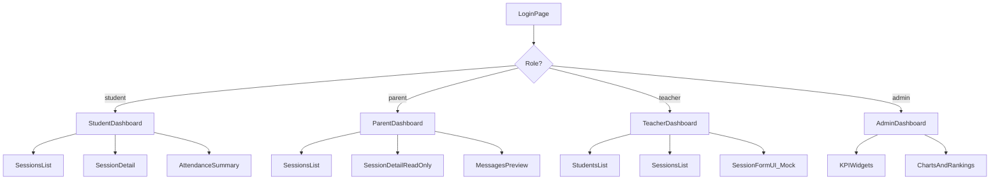

# PRD: پنل مدیریت زبان‌آموز و اولیا — Phase 1

## 1. Product Summary

**Product name:** پنل مدیریت زبان‌آموز و اولیا (Student & Parent Management Panel)

**Vision (from source PRD):** A unified education management system for language schools connecting **students**, **parents**, **teachers**, and **admins** around sessions, homework, grades, attendance, and communication.

**Phase 1 goal:** Ship a **frontend-only, role-based dashboard** with **mock data** so stakeholders can review UX, information architecture, and role permissions before backend work begins.

**Stack (confirmed):**

- Vite + React + TypeScript
- shadcn/ui + Tailwind CSS v4
- React Router
- Recharts (charts)
- Persian (Farsi) UI, **RTL layout**
- Mock login with hardcoded users per role

**Out of scope for Phase 1:**

- NestJS backend, PostgreSQL, WebSocket, S3 uploads
- Real authentication, API calls, file upload
- CRUD persistence (teacher/admin forms may exist but changes are local/mock only)
- Messaging send/receive, notification delivery
- Session report confirmation workflow (read-only preview only)

---

## 2. User Roles & Phase 1 Access

| Role      | Persian label | Mock user                        | Phase 1 dashboard                 |
| --------- | ------------- | -------------------------------- | --------------------------------- |
| `student` | زبان‌آموز     | `student@demo.local` / `demo123` | Personal progress overview        |
| `parent`  | ولی           | `parent@demo.local` / `demo123`  | Child report overview (read-only) |
| `teacher` | مدرس          | `teacher@demo.local` / `demo123` | Class overview + student list     |
| `admin`   | ادمین         | `admin@demo.local` / `demo123`   | School-wide analytics dashboard   |

After mock login, user is routed to their role-specific dashboard. Routes for other roles are blocked (redirect to own dashboard).

---

## 3. Information Architecture



**Shared app shell (all roles):**

- RTL sidebar + top bar
- Role badge, user name, logout
- Responsive layout (mobile: collapsible sidebar)

---

## 4. Role Dashboard Requirements

### 4.1 Student Dashboard (`/dashboard`)

**Purpose:** Read-only view of own learning progress (source PRD §4.1).

**Home widgets:**

- Profile card: name, level (e.g. B1), sessions completed / remaining
- Attendance summary: present / absent / late counts + attendance rate %
- Average session score (میانگین نمرات)
- Progress line chart (last 8 sessions)
- Recent sessions table (date, teacher, topic, attendance badge, final score)

**Session detail page (`/dashboard/sessions/:id`):**

- Header: date, teacher, topic, attendance status
- Sections (read-only):
  - Homework: title, description, status (Done/Not Done), score, teacher note
  - Participation: Yes/No, score, teacher note
  - Speaking assessment: questions, score, teacher feedback
  - Teacher evaluation: strengths, weaknesses, next-session recommendation
  - Final session score (computed from formula below)

**Score formula (display only, pre-calculated in mock data):**

- Homework 40% + Participation 20% + Speaking 30% + Teacher Note 10%

---

### 4.2 Parent Dashboard (`/dashboard`)

**Purpose:** Read-only view of linked child's full reports (source PRD §4.4).

**Home widgets:**

- Child selector (if multiple children in mock — start with 1 child)
- Same summary cards as student view
- Attendance monthly summary card
- Teacher evaluation highlights (latest strengths/weaknesses)
- Sessions list with "needs confirmation" badge (UI only — button disabled or shows toast "فاز بعد")

**Session detail:** Same as student, fully read-only.

**Messages preview (`/dashboard/messages`):**

- Static mock thread list per session
- Read-only message history (no send in Phase 1)

---

### 4.3 Teacher Dashboard (`/dashboard`)

**Purpose:** Operational overview; forms are UI-only with mock state (source PRD §4.6 — preview subset).

**Home widgets:**

- Total students, sessions this month, avg class score
- Students needing attention (low attendance or low scores) — table
- Upcoming / recent sessions

**Students list (`/dashboard/students`):**

- Table: name, level, avg score, attendance %, last session date
- Click → student detail (read-only profile + session history)

**Sessions list (`/dashboard/sessions`):**

- Filter by student
- Session detail with all assessment sections

**Session form UI (`/dashboard/sessions/new` — mock):**

- Form fields for attendance, homework, participation, speaking, teacher notes
- Submit shows success toast; **does not persist** (resets or no-op)

---

### 4.4 Admin Dashboard (`/dashboard`)

**Purpose:** School-wide analytics (source PRD §4.7).

**KPI cards:**

- میانگین نمرات کل زبان‌آموزان
- درصد انجام تکالیف
- درصد حضور
- نرخ مشاهده گزارش توسط اولیا (mock %)
- تعداد زبان‌آموزان فعال

**Charts:**

- Monthly progress bar/line chart (avg scores by month)
- Homework completion rate (donut or bar)
- Attendance rate trend
- Student ranking table (top 10 by avg score)

**No user CRUD in Phase 1** — admin is analytics-only.

---

## 5. Mock Data Model

TypeScript types in `src/types/index.ts` aligned with source PRD §5.

**Mock data files** in `src/mocks/`:

- `users.ts` — 4 login users + linked profiles
- `students.ts` — 8 students (1 linked to demo parent/student)
- `sessions.ts` — 18 sessions with full assessment data
- `messages.ts` — 5 sample threads
- `adminStats.ts` — aggregated KPIs and chart series

Use **Persian names** and **Jalali-style dates** (display via `Intl`; store ISO strings internally).

---

## 6. Auth (Mock)

**Flow:**

1. `src/pages/LoginPage.tsx` — username/password form
2. `src/contexts/AuthContext.tsx` — validates against `mockUsers`, stores user in `sessionStorage`
3. `src/components/ProtectedRoute.tsx` — guards `/dashboard/*`
4. Logout clears session and returns to login

**Hardcoded demo accounts:**

| Username             | Password  | Role    |
| -------------------- | --------- | ------- |
| `student@demo.local` | `demo123` | student |
| `parent@demo.local`  | `demo123` | parent  |
| `teacher@demo.local` | `demo123` | teacher |
| `admin@demo.local`   | `demo123` | admin   |

Show demo credentials hint on login page (collapsible "حساب‌های آزمایشی").

---

## 7. UI/UX Requirements

**RTL & Persian:**

- `<html dir="rtl" lang="fa">` in `index.html`
- Vazirmatn font via Google Fonts
- All labels, empty states, errors in Farsi
- shadcn components configured for RTL

**Design direction:**

- Clean dashboard aesthetic: light background, card-based layout, subtle borders
- Color-coded attendance badges: green (حاضر), red (غایب), amber (تأخیر)
- Score display as `/20` per session
- Accessible: focus states, semantic headings

---

## 8. Project Structure

```
student-managment/
├── docs/PRD-phase-1.md
├── src/
│   ├── types/
│   ├── mocks/
│   ├── contexts/AuthContext.tsx
│   ├── hooks/useMockData.ts
│   ├── layouts/DashboardLayout.tsx
│   ├── pages/
│   ├── components/shared/
│   ├── components/ui/
│   └── lib/
```

---

## 9. Routing Map

| Path                      | Role                     | Page                |
| ------------------------- | ------------------------ | ------------------- |
| `/login`                  | public                   | Login               |
| `/dashboard`              | all                      | Role-specific home  |
| `/dashboard/sessions`     | student, parent, teacher | Sessions list       |
| `/dashboard/sessions/:id` | student, parent, teacher | Session detail      |
| `/dashboard/attendance`   | student, parent          | Attendance summary  |
| `/dashboard/messages`     | parent                   | Messages preview    |
| `/dashboard/students`     | teacher                  | Students list       |
| `/dashboard/students/:id` | teacher                  | Student detail      |
| `/dashboard/sessions/new` | teacher                  | Mock session form   |

Admin uses `/dashboard` only (single-page analytics).

---

## 10. Acceptance Criteria

Phase 1 is **done** when:

1. Project scaffolds with Vite + React + TS + shadcn + Tailwind, RTL Persian UI
2. Mock login works for all 4 roles with route protection
3. Each role sees a distinct dashboard matching §4 requirements
4. Session list + detail pages render full mock assessment data
5. Charts render on student (progress) and admin (KPIs) dashboards
6. Teacher session form renders all fields; submit is mock-only (toast, no persistence)
7. Parent messages page shows read-only mock threads
8. App is responsive (desktop + mobile sidebar)
9. PRD document saved to `docs/PRD-phase-1.md`

---

## 11. Phase 2 Preview (not in scope)

- NestJS API + PostgreSQL
- Real JWT auth and role middleware
- Teacher CRUD persistence
- Parent session confirmation + notification log
- Messaging (WebSocket)
- File upload for homework (S3)
- Admin user/level management
